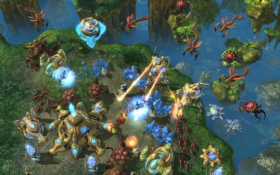

# Simple Bot for StarCraft2

[Burning](https://github.com/burning846)



## Mini Games

- [x] MoveToBeacon

- [x] BuildMarines

- [x] CollectiMineralsAndGas

- [x] CollectMineraShards

- [ ] DefeatZerglingsAndBanelings

- [x] FindAndDefeatZerglings

- [ ] DefeatRoaches

## Environment
- Ubuntu 18.04
- pysc2==2.0.2
- numpy==1.14.3
- StarCraft 2.4.7.1
- [mini games](https://github.com/deepmind/pysc2)

## Test Example
```shell
python -m pysc2.bin.agent --map <mapname> --agent <filename.classname>
```
For example 
```shell
python -m pysc2.bin.agent --map BuildMarines --agent BuildMarines.BuildMarines
```

